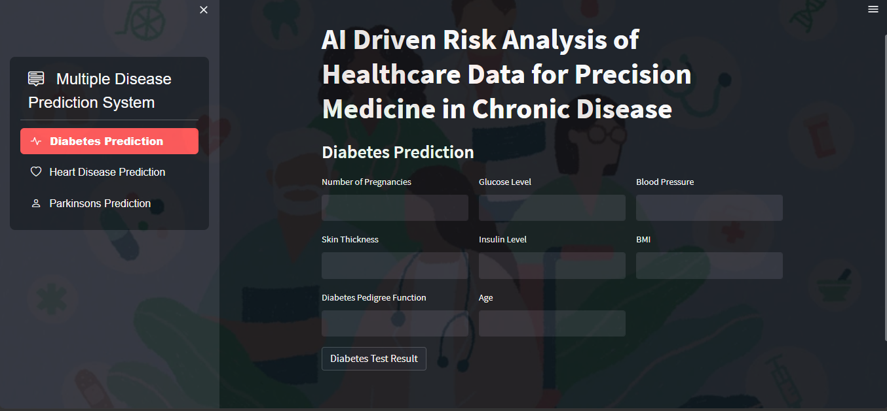
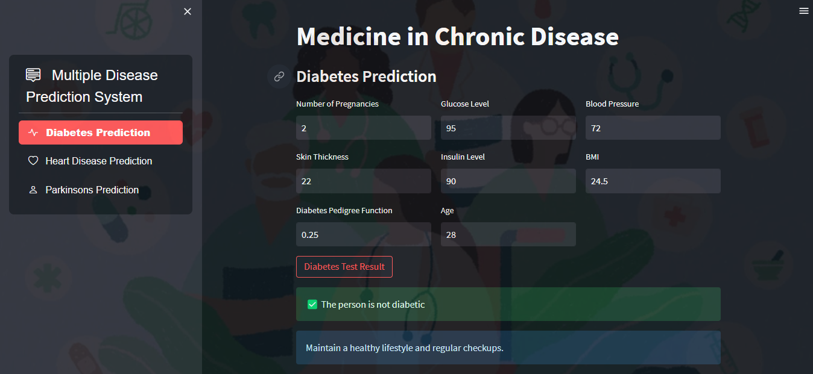
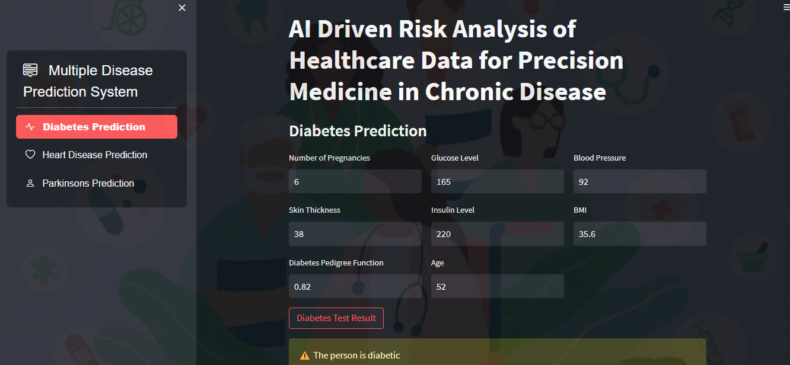
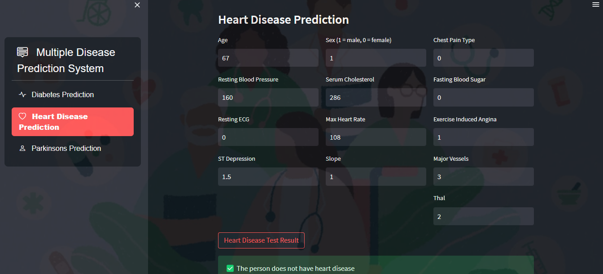
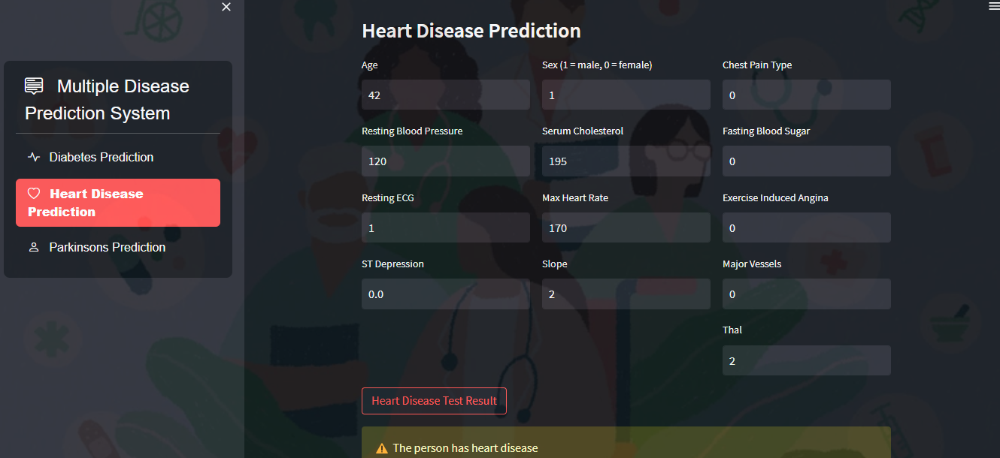
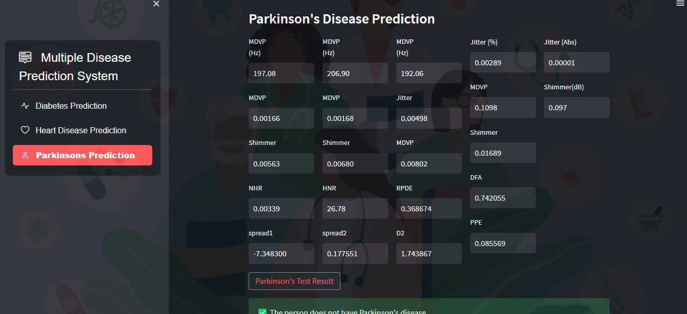
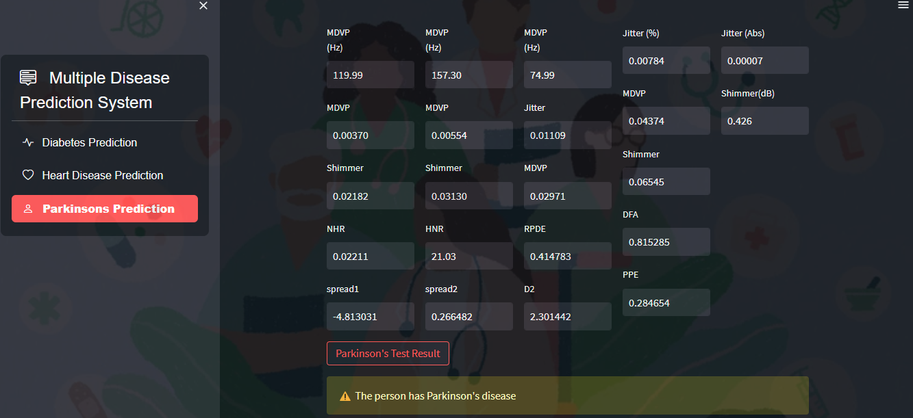
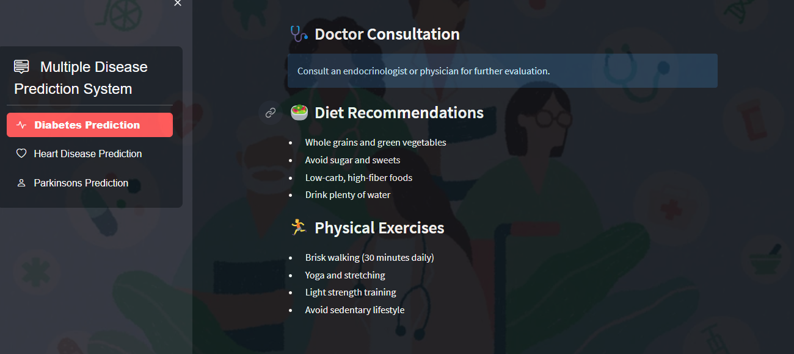
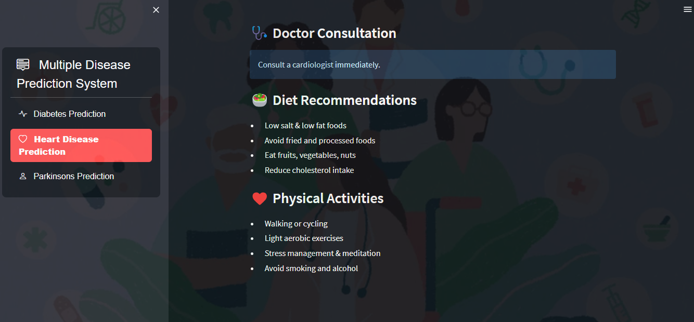
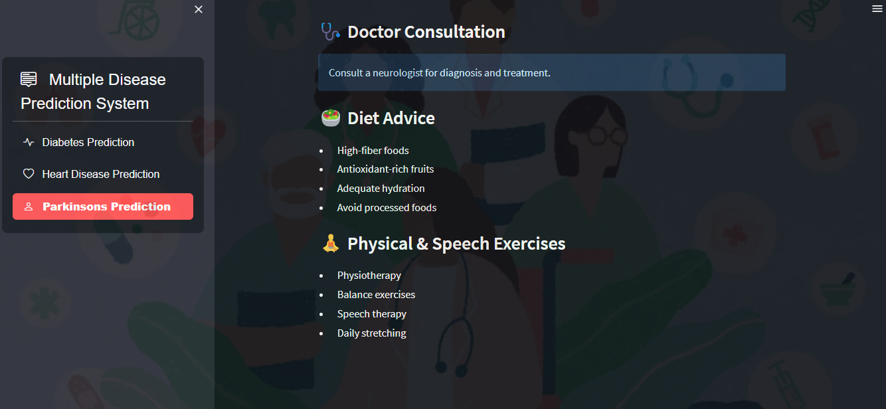

# Multiple Disease Prediction System using Machine Learning

A Streamlit web application that predicts the likelihood of **diabetes**, **heart disease**, and **Parkinson's disease** using trained machine learning models, based on user-entered medical data.



**🔗 Live Demo:**https://multiple-disease-prediction-system-yhysnzhpdyjjfcehezqxnk.streamlit.app/

## Table of Contents

- [Introduction](#introduction)
- [Features](#features)
- [Screenshots](#screenshots)
- [Tech Stack](#tech-stack)
- [Models & Datasets](#models--datasets)
- [Project Structure](#project-structure)
- [Setup](#setup)
- [Usage](#usage)
- [Contributing](#contributing)
- [License](#license)

## Introduction

This project provides a single, unified interface for predicting three different diseases using disease-specific machine learning models. Users input relevant medical measurements and receive an instant prediction, along with personalized diet and lifestyle recommendations, without needing any machine learning background themselves.

## Features

- **Multi-Disease Support** — one app, three prediction models (diabetes, heart disease, Parkinson's).
- **User Input Forms** — simple form-based input for each disease's relevant medical parameters.
- **Instant Predictions** — models run locally and return results in real time.
- **Personalized Recommendations** — each result includes tailored doctor-consultation, diet, and exercise guidance.
- **Sidebar Navigation** — switch between disease predictors using `streamlit-option-menu`.
- **Lightweight Deployment** — no external API calls or paid services required; runs fully offline once set up.

## Screenshots

### Diabetes Prediction

| Negative Diagnosis | Positive Diagnosis |
|---|---|
|  |  |

### Heart Disease Prediction

| Negative Diagnosis | Positive Diagnosis |
|---|---|
|  |  |

### Parkinson's Disease Prediction

| Negative Diagnosis | Positive Diagnosis |
|---|---|
|  |  |

### Personalized Medical Recommendations

| Diabetes | Heart Disease | Parkinson's |
|---|---|---|
|  |  |  |

## Tech Stack

- **Language:** Python
- **Web Framework:** [Streamlit](https://streamlit.io/)
- **Navigation:** streamlit-option-menu
- **ML Library:** scikit-learn
- **Data Handling:** pandas, numpy
- **Model Serialization:** pickle (`.sav` files)

## Models & Datasets

| Disease | Algorithm | Dataset | Samples | Features | Train / Test Accuracy |
|---|---|---|---|---|---|
| Diabetes | Support Vector Machine (RBF kernel, C=1000) | [Pima Indians Diabetes Dataset](https://www.kaggle.com/datasets/uciml/pima-indians-diabetes-database) | 768 | 8 | ~99% / ~70% |
| Heart Disease | Logistic Regression (C=5000) | [UCI Heart Disease Dataset](https://archive.ics.uci.edu/dataset/45/heart+disease) | 303 | 13 | ~85% / ~71% |
| Parkinson's Disease | Support Vector Machine (linear kernel) | [UCI Parkinson's Dataset](https://archive.ics.uci.edu/dataset/174/parkinsons) (voice measurements) | 195 | 22 | ~87% / ~87% |

> Accuracy scores are from the project's original training notebooks (90/10 split, `random_state=42` for diabetes/heart; 80/20 split, `random_state=2` for Parkinson's). The gap between train and test accuracy for the diabetes model reflects some overfitting from the high `C=1000` value — a good candidate for future tuning (e.g., cross-validation, lower `C`, or `GridSearchCV`).

> **Preprocessing note (important, and easy to get wrong):** The diabetes and heart disease models were trained on **standardized** features (`StandardScaler`) and each ships with its own fitted scaler (`diabetes_scaler.sav`, `heart_scaler.sav`) that user input must pass through before prediction. The **Parkinson's model was trained on raw, unscaled features** — do not scale its input, or predictions will be wrong. Keep each model paired with its correct (or absent) scaler if you retrain or redeploy.

## Project Structure

```
Multiple-Disease-Prediction-System/
├── outputs/
│   ├── Home_Dashboard.png
│   ├── Diabetes_Prediction_-_Negative_Diagnosis.png
│   ├── Diabetes_Prediction___Positive_Diagnosis.png
│   ├── Heart_Disease_Prediction___Negative_Diagnosis.png
│   ├── Heart_Disease_Prediction___Positive_Diagnosis.png
│   ├── Parkinson_s_Disease_Prediction___Negative_Diagnosis.png
│   ├── Parkinson_s_Disease_Prediction___Positive_Diagnosis.png
│   ├── Personalized_Medical_Recommendations__Diabetes_.png
│   ├── Personalized_Medical_Recommendations__Heart_Disease_.png
│   └── Personalized_Medical_Recommendations__Parkinson_s_Disease_.png
├── models/
│   ├── diabetes_model.sav
│   ├── diabetes_scaler.sav
│   ├── heart_disease_model.sav
│   ├── heart_scaler.sav
│   └── parkinsons_model.sav
├── datasets/
│   ├── diabetes.csv
│   ├── heart.csv
│   └── parkinsons.csv
├── app.py
├── requirements.txt
└── README.md
```

## Setup

1. Clone the repository:

```bash
git clone https://github.com/Amit380/Multiple-Disease-Prediction-System-using-Machine-Learning.git
cd Multiple-Disease-Prediction-System-using-Machine-Learning
```

2. (Recommended) Create and activate a virtual environment:

```bash
python -m venv venv
source venv/bin/activate   # On Windows: venv\Scripts\activate
```

3. Install the required dependencies:

```bash
pip install -r requirements.txt
```

4. The pre-trained models are already included in the `models/` directory — no separate download needed. Note that the diabetes and heart disease models each require their matching scaler (`diabetes_scaler.sav`, `heart_scaler.sav`) to produce correct predictions; the Parkinson's model does not use a scaler.

## Usage

1. Open a terminal and navigate to the project directory.

2. Run the Streamlit app:

```bash
streamlit run app.py
```

3. Open the local URL shown in the terminal (typically `http://localhost:8501`) in your browser.

4. Select a disease from the sidebar menu.

5. Enter the requested medical parameters.

6. Click the test result button to view the prediction and personalized recommendations.

## Contributing

Contributions are welcome! To contribute:

1. Fork the repository
2. Create a new branch (`git checkout -b feature/your-feature`)
3. Commit your changes
4. Open a pull request describing what you changed and why

Feel free to open an issue for bugs, feature requests, or questions.

## License

This project is licensed under the [MIT License](LICENSE). You are free to use and modify the code for personal and commercial purposes.
